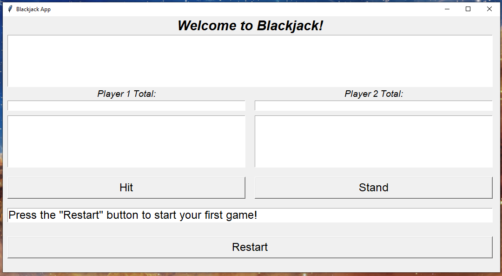
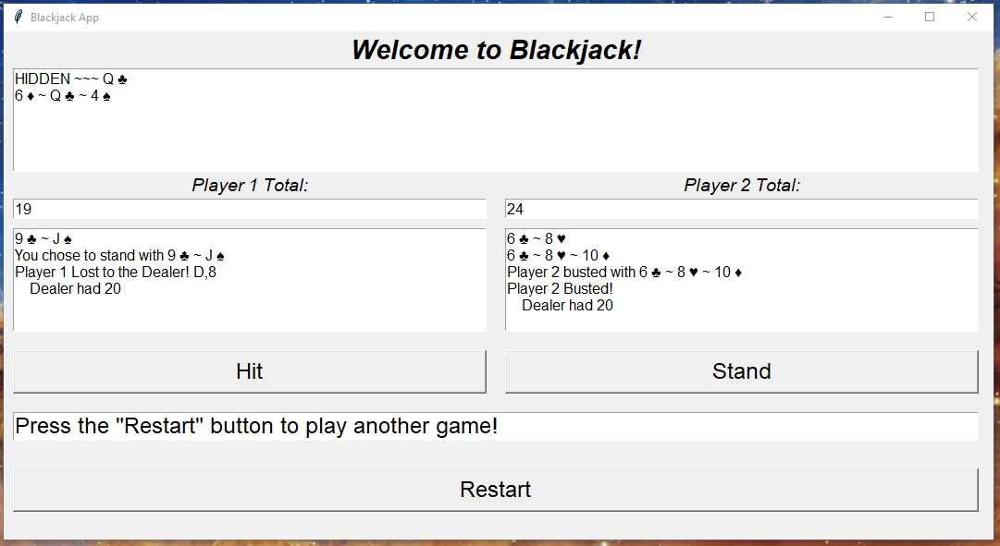

# Blackjack App
This project was a weekend project for Coding Temple.  The minimum requirement was to make a CLI based blackjack application using the most basic rules of blackjack and OOP.  I am not the biggest fan of this types of card games, so I didn't add too many of the more refined rules, and instead decided to take a dive into using tkinter (also an encouraged extra to go above and beyond).  

## Project Description:
In this repository there are two files that will allow you to play blackjack.  

I started off making a CLI based game with some extra rules and betting implemented.  Outside of vanilla Python I used the `shuffle` function from the `random` module to randomize my deck, and the `copy` module to create a deep copy of my dealers hand to display it with a card hidden.  Things like a player starting with a blackjack will remove them from the rotation for the round, and the dealer getting a blackjack immediately makes everyone tie or lose.  That file is called `blackjack_with_betting.py`. 

There are some extra features in some of the classes that are not in use that make it easy to expand functionality.  The main feature I wanted to ensure was baked in somewhere was the ability to shuffle up more than one deck at once.  For a basic proof of concept, a single deck is enough to get started with, but for things like card counting, simulating the correct odds environment is important.

Once I felt comfortable working with some game parameters, I chose to take a shot at working out how `tkinter` worked.  I stripped my game back to the most basic form and in the the process accidentally removed some of the automatic fail safes and checks.  I used the grid methods to lay out my app, and set up a pair of `.wait_variable` expressions and replaced the input expression with a `.get()` method to pull from a `StringVar` to handle hitting and standing instead of the normal python `input()`.  For some reason it can act a little laggy or miss input from ime to time though.  I had a hard time getting this app up and running, and I do not think this is the optimal way to handle the betting, but it works.
**Tkinter app on launch:**

**Tkinter app at end of game:**

## Installing, Running, and How to use:
You should be able to just clone this repository and run this as long as you are using Python 3.8 or newer.  I started developing my functions in Jupyter notebook using Python 3.8 and eventually moved over to VSCode where I was using 3.9.

To run the CLI one, while in the correct folder in your prompt window, run:
`python blackjack_with_betting.py`

To run the tkinter pop out one, from the prompt window, run:
`python tkinter_blackjack_app.py`

Once running there should be text prompts guiding you what to do next.  I think there is a way to create a more graceful closing process with tkinter but I could not get it to work, so if you close out of the app in the middle of a game it can cause the python console to get caught up.

## Future Improvement:
It should be easy to keep adding upgrades to the tkinter app, and the classes that set up the deck, people, and game are set up to be expanded on.  Some of the function that runs the decision making of the game could probably be made internal to the `Blackjack` class.
- Add the refined condition handling
    - The framework should already be in the CLI one

- Add styling to the app
    - Getting this running took a lot longer than I expected, so I am turing it in with with a default color scheme.
    - I also was not super explicit about setting up my grid layout which I saw people discussing in forums.  Doing this might help deal with some of the resizing issues I had when adding elements.
        - Because of this, I will also attach a screenshot of what the app looks like on my screen when it launches incase you load it in and it acts funny.  I know there are lots of styling thing you can do to make stuff auto-size and look better.

- Add betting to the tkinter app
    - Could not figure out how to do the multi-page methods in its current state.  Converting the app over to the Class methods that are used with tkinter would probably make this easier.

- Make it multi-page to select number of players and automatically format the playing page instead of having it stuck at 2 players vs the dealer

- Add splitting and doubling down
    - splitting would require a secondary loop that would handle the initial hand as `hand = [['card','card']]` so that when the split choice is made, the hand becomes `hand = [['card','new_card'],['card','new_card']]`.

## Credits:
To get tkinter working, I watched a bunch of youtube videos and copied their formats and methods to get myself up and running.  The main ones I watched multiple times were:

[NeuralNine - Tkinter Beginner Course - Python GUI Development](https://www.youtube.com/watch?v=ibf5cx221hk&t=992s)
[NeuralNine - Simple GUI Calculator in Python](https://www.youtube.com/watch?v=NzSCNjn4_RI&t=313s)
[Tkinter Hub](https://www.youtube.com/@tkinterhub) (A bunch of their stuff)

Also from digging around online, I used [tutorialspoint](www.tutorialspoint.com) quite a bit for some better explanation about the tkinter documentation. 

The tkinter documentation can be found [here](https://python.readthedocs.io/en/stable/library/tkinter.html).
